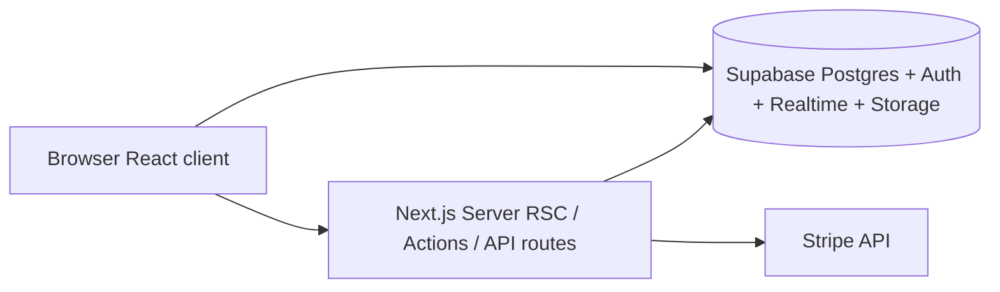

# ChanceUS — Full Project Breakdown

*Generated as a downloadable reference. Env values belong in `.env.local` or your host — do not paste secrets into git.*

---

## 1. What it is

**ChanceUS** is a **skill-based gaming web app**: head-to-head matches, **token-based stakes**, **tournaments**, **bar trivia** flows, plus social layers (friends, chat), **wallet** (Stripe), **spectators**, **replays**, and an **analytics** area. The product pitch in code is “skill-based games where talent maps to tokens,” deployed as a **Next.js** app on **Vercel** with **Supabase** as backend.

---

## 2. Repository layout

| Area | Role |
|------|------|
| `app/` | **Entire application** (Next.js root: `package.json`, `app/`, `components/`, `lib/`, `hooks/`, `scripts/`, config). |
| `app/app/` | **App Router** pages, layouts, and API `route.ts` handlers. |
| `app/components/` | UI: games, dashboard, tournaments, wallet, chat, navigation, shadcn-style `ui/`, feedback, etc. |
| `app/lib/` | **Server modules and “actions”** (Supabase, game/tournament/wallet/chat logic, auth helpers). |
| `app/hooks/` | Client hooks (match realtime, math blitz, bot autoplay, user activity). |
| `app/utils/supabase/` | Additional Supabase client/middleware helpers (overlap with `lib/supabase/`). |
| `app/scripts/` | **SQL migrations** (`01-…` through `26-…`) and **Node maintenance/seed** scripts. |
| Markdown docs | `README.md`, `ENVIRONMENT_SETUP.md`, `PROJECT_DOCUMENTATION.md`, `FEATURES_IMPLEMENTATION.md`, `TOURNAMENT_SYSTEM.md`, `REALTIME_IMPLEMENTATION.md`, `TESTING_GUIDE.md`, `SCRIPTS_SECURITY.md`, `PRODUCTION_READINESS_ROADMAP.md`. |

There is **no separate backend service** in-repo: logic is **Next.js server components, server actions, and route handlers** talking to Supabase (and Stripe from the server).

---

## 3. Tech stack (from `package.json` + layout)

- **Framework**: Next.js **15.5.x**, **App Router**, React **19**, TypeScript **5**.
- **Package manager**: **pnpm** (peer rules pin React 19).
- **Styling/UI**: **Tailwind CSS 3.4**, **Radix UI** primitives across many components, **class-variance-authority**, **tailwind-merge**, **tailwindcss-animate**, **Lucide** icons, **Geist** + **next/font** (Poppins, Open Sans, JetBrains Mono).
- **Forms/validation**: **react-hook-form**, **@hookform/resolvers**, **Zod**.
- **Data/auth/realtime**: **@supabase/supabase-js**, **@supabase/ssr**, **@supabase/auth-helpers-nextjs**.
- **Payments**: **Stripe** server SDK + **@stripe/react-stripe-js** / **@stripe/stripe-js** for wallet/checkout flows.
- **Charts**: **Recharts**.
- **Misc UX**: **Sonner** / toast UI, **next-themes**, **vaul** (drawers), **cmdk**, **embla-carousel-react**, **QR** (`qrcode`, `react-qr-code`, `react-qr-scanner`), **date-fns**, **dotenv** (used by scripts).

**Ads**: `app/layout.tsx` loads **Google AdSense** (`adsbygoogle.js`) with a fixed publisher client id.

---

## 4. Runtime architecture

- **Auth**: Supabase Auth; OAuth returns via `app/auth/callback/route.ts`; session refresh wired through **middleware** (`middleware.ts` → `lib/supabase/middleware`).
- **Live play**: Match rows (and related tables) subscribed over **Supabase Realtime**; documented pattern in `REALTIME_IMPLEMENTATION.md` (`useMatchRealtime`, `EnhancedMatchInterface`).
- **Money/tokens**: Server routes create Stripe **Checkout** or **Payment Intents**; fulfillment routes update wallet/token state (`app/api/*`).

---

## 5. App routes (surface area)

**Marketing / shell**

- `/` — Home (game cards, CTAs; requires Supabase env or shows “Connect Supabase”).

**Auth**

- `/auth/login`, `/auth/sign-up` — Forms; callback at `/auth/callback`.

**Core product**

- `/dashboard` — Hub (stats, quick actions, recent matches, friends online, etc.).
- `/games` — Game discovery / matchmaking entry.
- `/games/[gameId]`, `/games/[gameId]/create`, `/games/[gameId]/play` — Per-game flows.
- `/games/match/[matchId]` — Live match UI (realtime games).
- `/matches` — Match listing (if used in nav).

**Tournaments**

- `/tournaments`, `/tournaments/create`, `/tournaments/[tournamentId]` — Brackets, registration, detail (password gate component exists for listing).

**Wallet**

- `/wallet` — Token purchase UI (Stripe components).

**Social / comms**

- `/friends/add`
- `/chat`, `/chat/dm/[userId]`

**Engagement / retention**

- `/watch` — Live/spectator-oriented browsing.
- `/replays/[matchId]`, `/replays/share/[shareToken]` — Replay playback and share links.
- `/analytics` — Stats dashboard (Recharts, leaderboards).

**Account**

- `/profile`, `/settings`

**Bar trivia**

- `/bars`, `/bars/create`, `/bars/[barId]`, `/bars/[barId]/dashboard`, `/bars/[barId]/session/[sessionId]`
- `/bar/join`, `/bar/session/[sessionId]`, `/demo-bar`
- `/session/[sessionCode]` — Session join by code.

**Misc / internal**

- `/supabase-todos` — Likely dev/demo.
- `/debug`, `/debug-games`, `/debug-matches` — **Blocked in production** by `middleware.ts` (redirect to `/`).

**API (`route.ts`)**

- `POST`/`GET` handlers for **Stripe**: `create-checkout-session`, `create-payment-intent`, `fulfill-checkout`, `fulfill-payment-intent`.
- `api/debug-token` — Debug-oriented.
- `auth/callback` — OAuth exchange.

---

## 6. Games (product layer)

From `app/page.tsx` and file names, the live catalog is built around **three game types** (UUIDs on the home page are the DB `games` row ids):

1. **Math Blitz** — Timed arithmetic (`multiplayer-math-blitz.tsx`, `use-math-blitz.ts`).
2. **Four in a Row** — Connect Four style (`connect-four.tsx`, `simple-connect-four.tsx`, bot autoplay hook/actions).
3. **Trivia Challenge** — Category trivia (`multiplayer-trivia-challenge.tsx`, `trivia-challenge.tsx`); scripts seed trivia SQL/JSON.

**Shared gameplay infrastructure**: `enhanced-match-interface.tsx`, `matchmaking-interface.tsx`, `game-logic.ts`, `game-actions.ts`, `complete-match-action.ts`, `deduct-match-tokens.ts`, realtime hook, spectator/replay plumbing.

---

## 7. `lib/` responsibilities (server-side brain)

| File / area | Purpose |
|-------------|---------|
| `supabase/*`, `supabase/admin.ts` | Browser/server/admin Supabase clients; middleware session helper. |
| `actions.ts` | General server actions (umbrella). |
| `game-actions.ts`, `complete-match-action.ts`, `matchmaking-actions.ts` | Match lifecycle, queueing, updates. |
| `tournament-actions.ts` | Tournament registration, brackets, progression. |
| `wallet-actions.ts`, `buyTokens.ts`, `transferTokens.ts` | Token economy + purchases. |
| `friends-actions.ts`, `chat-actions.ts` | Social graph and messaging. |
| `bar-actions.ts` | Bar trivia entities. |
| `analytics-actions.ts`, `replay-actions.ts`, `spectator-actions.ts` | Post-game and viewing. |
| `settings-actions.ts`, `user-utils.ts`, `auth-utils.ts`, `auth-fix.ts` | Profiles and auth edge cases. |
| `feedback-actions.ts` | User feedback (schema referenced in docs). |
| `cleanup-actions.ts`, `force-complete-matches.ts` | Operational fixes. |
| `config.ts` | `NEXT_PUBLIC_SITE_URL` and Supabase public config for callbacks. |
| `supabase/functions/buy_tokens/index.ts` | Edge-function style buy-tokens logic (may mirror or complement API routes). |

Pattern: **thick `*-actions.ts` layer** + **thin pages** that compose React components.

---

## 8. Database & migrations

Schema is **not generated in-repo by Prisma**; it lives as **SQL scripts** under `app/scripts/`, for example:

- `01-create-tables.sql` — Core tables.
- `02-seed-games.sql` — Game seed.
- `04-enable-realtime.sql` — Realtime publication for matches/history.
- `06-bar-trivia-schema.sql` — Bar trivia.
- `08-create-friends-table*.sql` — Friends.
- `10-create-tournament-schema.sql`, `11-enable-tournament-realtime.sql`, follow-ups `12–15`, `22–26` — Tournaments + RLS fixes.
- `18–21` — Chat + realtime enhancements.
- `19-create-spectator-replay-schema.sql` — Spectators + replays.
- `20-create-analytics-schema.sql`, `20-create-feedback-schema.sql` — Analytics and feedback.

**Operational note (from docs):** `PROJECT_DOCUMENTATION.md` calls out **RLS** issues and scripts like `disable-rls-temporarily.sql` / `disable-bar-rls-temporarily.sql` as workarounds — important for security posture, not just features.

---

## 9. Scripts folder (non-Next code)

- **SQL**: numbered migrations and one-off fixes (`fix-bar-staff-policies.sql`, `cleanup-sql.sql`, etc.).
- **JS/MJS**: `seed-games-now.js`, trivia seeders, tournament `fast-forward` / `seed-tournament-players.mjs`, and many **cleanup/debug** scripts for matches, duplicates, prize pool, etc. (`SCRIPTS_SECURITY.md` describes how to treat them safely).

---

## 10. Environment & deployment

**Required** (see `README.md` / `ENVIRONMENT_SETUP.md`):

- `NEXT_PUBLIC_SUPABASE_URL`
- `NEXT_PUBLIC_SUPABASE_ANON_KEY`
- `NEXT_PUBLIC_SITE_URL`

**Optional / feature-specific:**

- Stripe: `STRIPE_SECRET_KEY`, `NEXT_PUBLIC_STRIPE_PUBLISHABLE_KEY`
- `NEXT_PUBLIC_TOURNAMENT_GATE_PASSWORD` (optional gate for tournaments page)

**Supabase dashboard**: redirect URLs for `/auth/callback` (local + production). Apple Sign-In is documented as optional.

**Build commands**: `pnpm dev`, `pnpm build`, `pnpm start`, `pnpm lint`.

---

## 11. Documentation vs code reality

- **`FEATURES_IMPLEMENTATION.md`** marks spectator, replay, analytics, and expanded chat as **implemented** with concrete files — while **`PROJECT_DOCUMENTATION.md`** still contains an older **“Missing Features”** list that may contradict that (stale section).
- **`TOURNAMENT_SYSTEM.md`** describes **single elimination**, up to **100** players, prize pool from entry fees, auto-advance — aligned with `tournament-*` components and SQL.

---

## 12. Risks / quality signals called out in-repo

From `PROJECT_DOCUMENTATION.md` and file names (summarized):

- **Match status edge cases** (waiting vs `in_progress` when both players present).
- **RLS** complexity on bar/tournament tables; temporary disable scripts exist.
- **Heavy `console.log`** usage noted in docs.
- **Duplicate Supabase helper locations** (`lib/supabase` vs `utils/supabase`) — maintenance overhead.

**Security hygiene:** Prefer not to commit real secrets into markdown; use `.env.local` and host dashboards. Rotate keys if anything sensitive was ever committed.

---

## 13. One-line mental model

**ChanceUS = Next.js 15 + React 19 + Tailwind/Radix UI + Supabase (auth/DB/realtime/storage) + Stripe wallet + three realtime games + tournaments + bar trivia + social/chat + analytics/replays/spectators**, with SQL migrations and maintenance scripts living beside the app under `app/scripts/`.

---

## How to download this file

- **Path**: `app/PROJECT_BREAKDOWN.md` (relative to repo root: `ChanceUS/app/PROJECT_BREAKDOWN.md`).
- In Cursor/VS Code: right-click the file in the explorer → **Reveal in Finder** (macOS), then copy or share.
- Or from terminal: `open /Users/aadikatyal/Dev/ChanceUS/app/PROJECT_BREAKDOWN.md` (macOS).
