# Event Flows

Solid arrows in the diagrams are synchronous calls. Dotted arrows are bus events. The client waits only on the synchronous path. A step that says "ack" is the consumer writing its idempotency row.

## Player signup

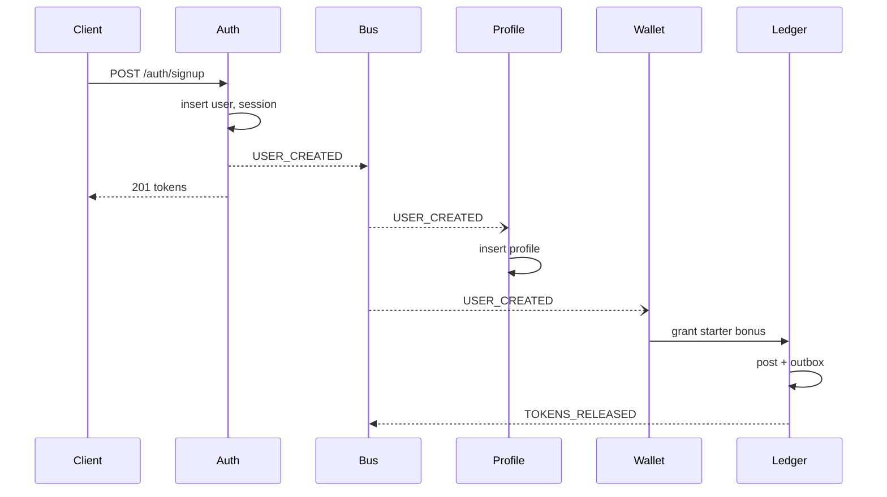

Sync: signup. Async: profile row and grant. The client may open `/me` before the profile exists. Profile's GET repairs once by creating the row if Auth says the user exists. Wallet's first read repairs a missing wallet the same way. Repair uses the same idempotency key `user:{id}:starter`.

## Friend request

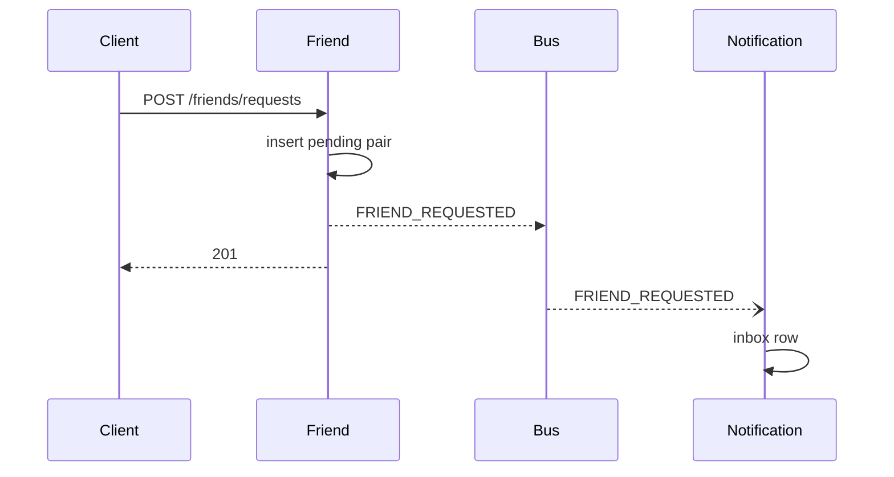

Accept repeats the shape with `FRIEND_ACCEPTED`. Sync is the row. Notification is async.

## Queue join

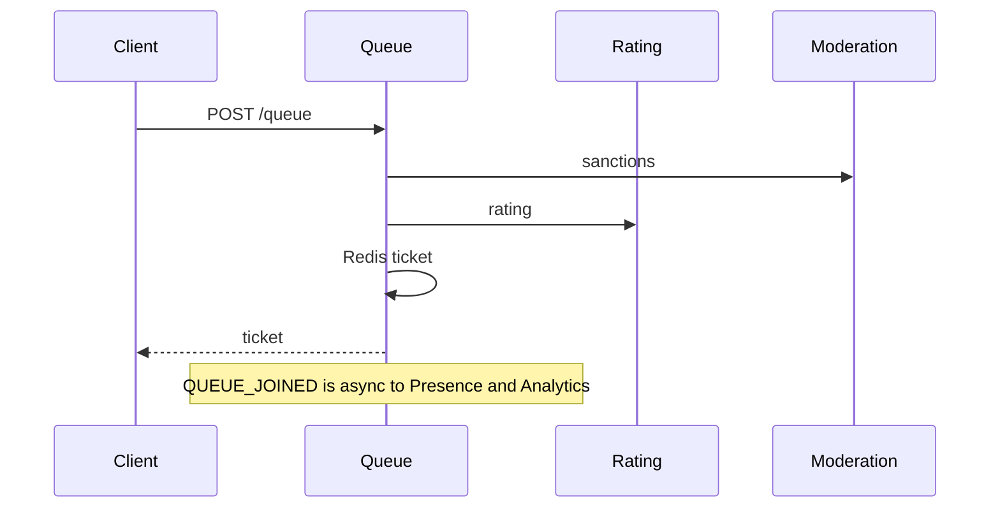

No Wallet call. Leaving is `DELETE /queue`, Redis delete, then async `QUEUE_LEFT`. If the ticket is already inside a ready check in the last 5 seconds, Queue still removes it and records a dodge.

## Match found and ready check

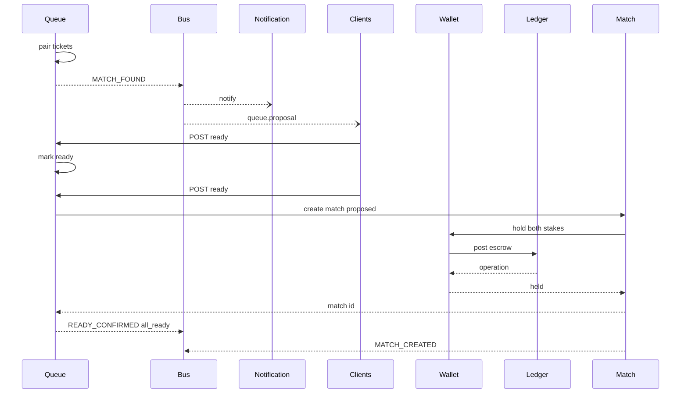

Sync and on the critical path: both readies, match insert, ledger hold. If the second hold fails, Match cancels, Wallet releases the first hold with key `release:{match}`, Queue requeues the solvent player. Notification of `MATCH_FOUND` is async and may arrive late. The proposal deadline does not extend to wait for a push.

## Match start

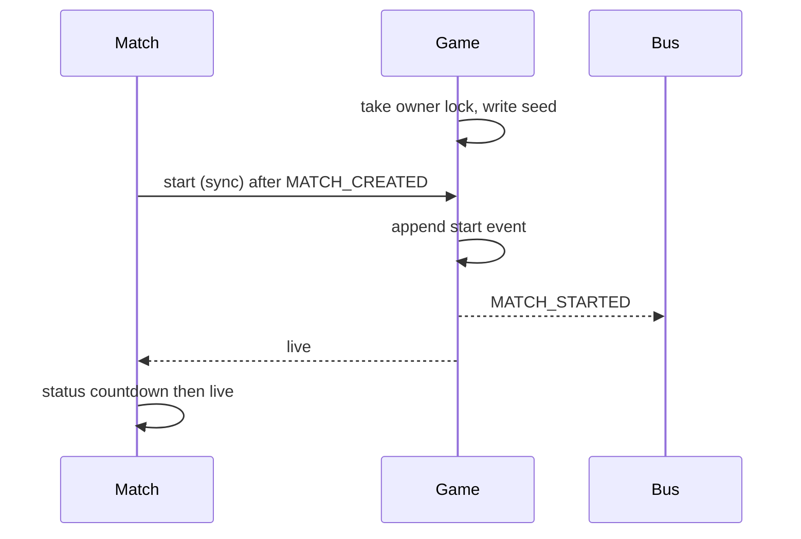

Match's sync start call and Game's `MATCH_STARTED` are the same transition. If the sync call succeeds, the event is the fan-out. If the sync call times out, Match voids after 10 seconds unless Game has written the start event. Game's start is idempotent on match id.

## Disconnect and reconnect

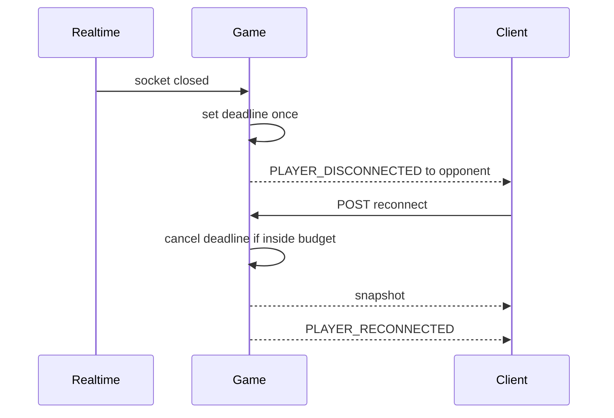

Sync: reconnect returns the snapshot. The disconnect event is async to the opponent and must not be the only timer. Game's local timer is the authority. A duplicate disconnect does not move the deadline. A reconnect with an expired budget returns `409` and the forfeit path runs once.

## Match finish

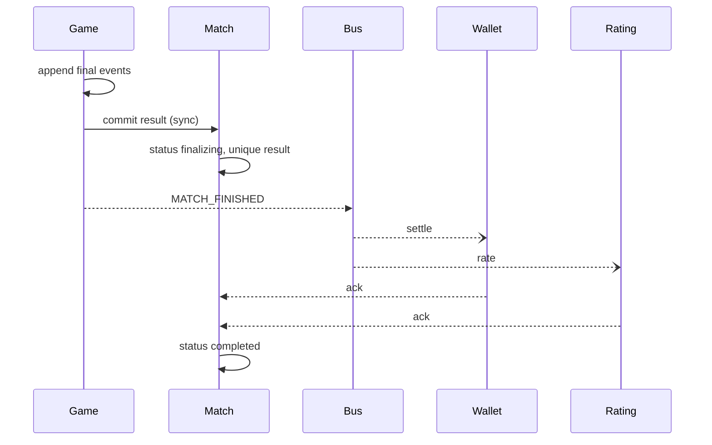

The sync result insert and the event carry the same `event_id`. Consumers that see the event before the row wait and retry. Consumers that see a duplicate ack. Match does not pay and does not rate.

## Escrow settlement

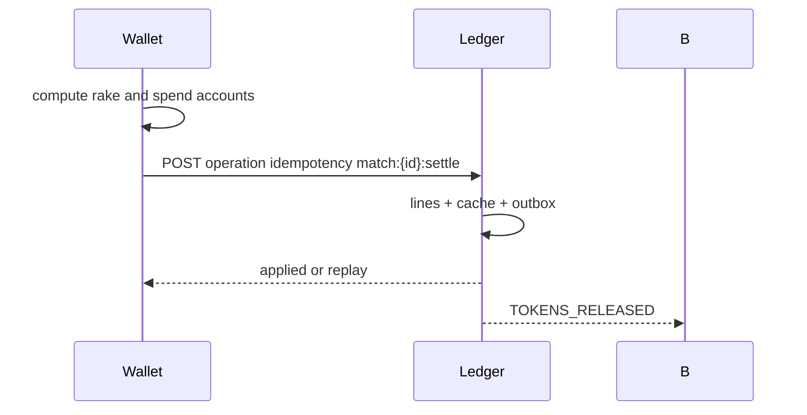

One operation, many lines (winner credit, rake credit, escrow debits). A retry posts nothing new.

## Rating update and promotion

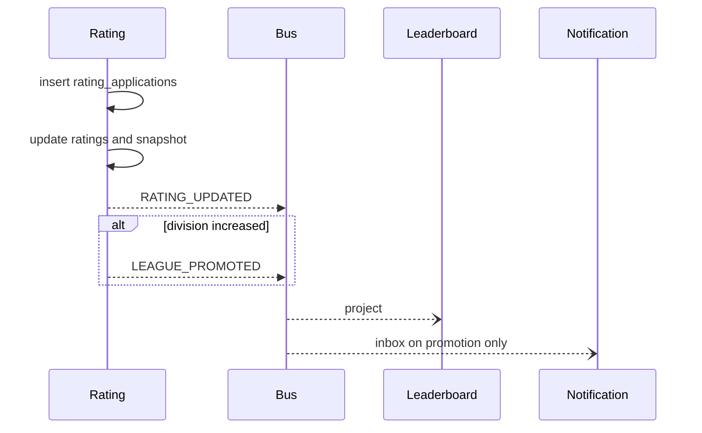

Async after the rating transaction. Queue reads Redis, which Rating updates in that same transaction's after-commit hook: write Redis, then the outbox publisher is the backup if Redis write failed. On Redis failure, Queue's next read misses and loads from the Rating API.

## Achievement unlock

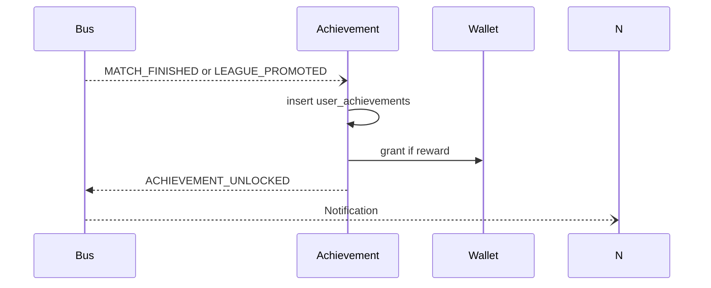

The unlock row commits before the grant. If the grant fails, the event is not published and the consumer retries. The unlock insert is idempotent so the retry only grants.

## Quest completion

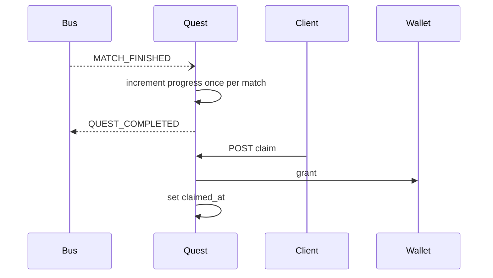

Progress is async. Claim is sync and fails closed. `QUEST_COMPLETED` does not pay. Only the claim does, so a quest cannot pay twice from a replayed event.

## Tournament registration, advancement, payout

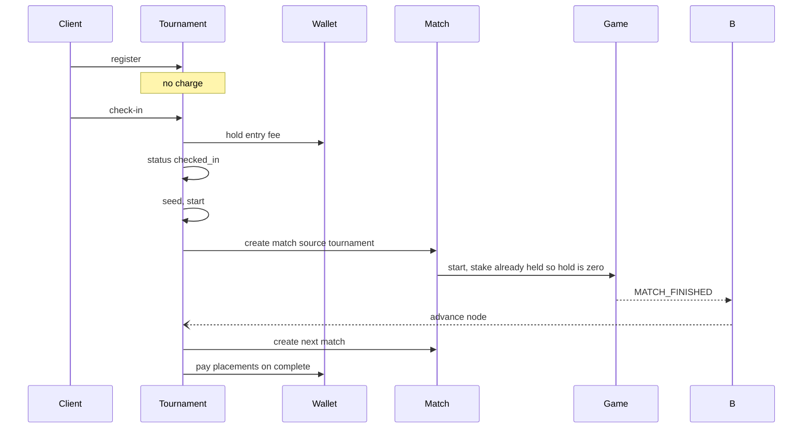

Registration is sync and free. Check-in is sync with Wallet. Advancement is async and ordered per tournament id. Payout is one Wallet call per placement, each with its own idempotency key, triggered once by `TOURNAMENT_COMPLETED`.

A format change replaces the "seed, start" and "advance node" boxes inside Tournament. The Wallet calls stay "hold a fee" and "pay these amounts."

## Venue check-in

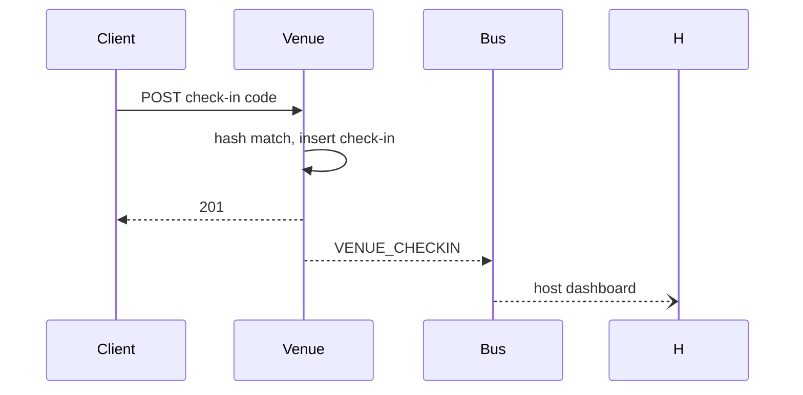

Sync is the insert. The dashboard is async. No Wallet call.

## Notification delivery

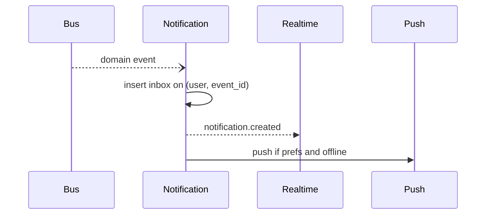

Inbox insert is the durable step. Realtime and push are after the commit. If push fails, the inbox row remains. A second delivery of the same event hits the unique key and does not push again, because the delivery attempt row is inserted in the same transaction as the inbox row before the push is attempted. Push retry reads pending attempts, max 3.

## Sync versus async summary

| Step | Mode |
| --- | --- |
| Auth, profile repair, queue join, ready, ledger post, match create, input, reconnect, quest claim, check-in, tournament register | Synchronous |
| Email, presence, inbox, push, leaderboard, achievements, quest progress, rating projection, analytics, search, replay archive, club points | Asynchronous |
| Rating apply and wallet settle after `MATCH_FINISHED` | Asynchronous but required before `completed` |
